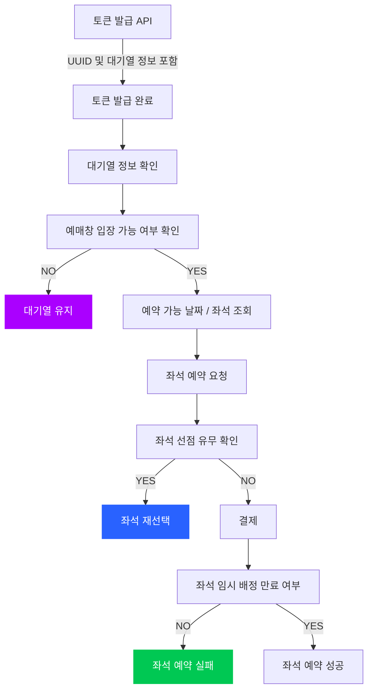

# hanghae_week3

**예매하기 FLOW CHART**

**[대기열 다이어그램 링크](https://www.mermaidchart.com/app/projects/100d9e03-3136-4578-90b4-2fa1d5595bb6/diagrams/95c31869-1abf-458c-85c6-bd54237bfb58/version/v0.1/edit)**

**[예매 다이어그램 링크](https://www.mermaidchart.com/app/projects/100d9e03-3136-4578-90b4-2fa1d5595bb6/diagrams/8e0b7df1-5377-4323-a58c-58b175e6dc05/version/v0.1/edit)**

**[결재 다이어그램 링크](https://www.mermaidchart.com/app/projects/100d9e03-3136-4578-90b4-2fa1d5595bb6/diagrams/3d82a63e-9eb1-4a5a-8969-673014bd7d73/version/v0.1/edit)**
