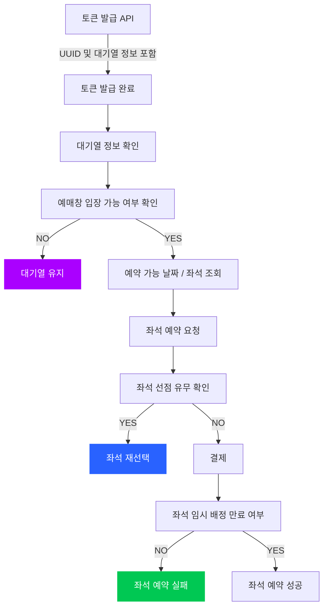
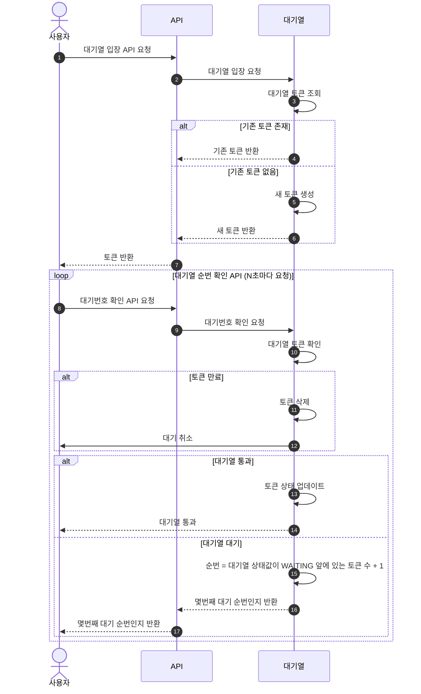
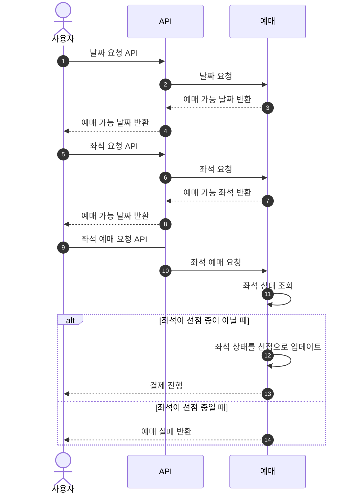
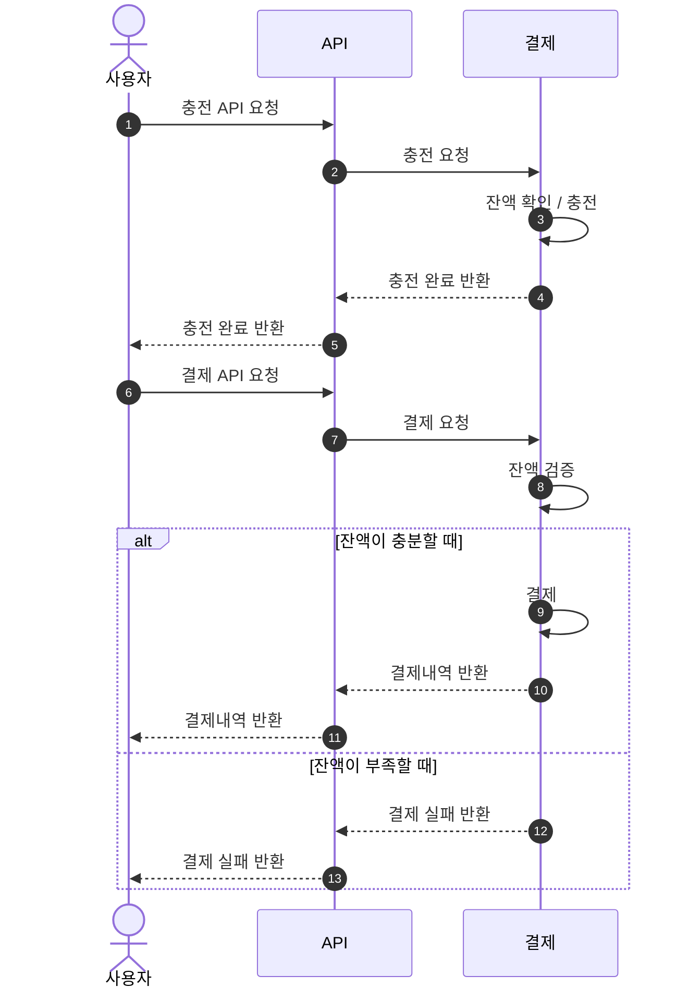
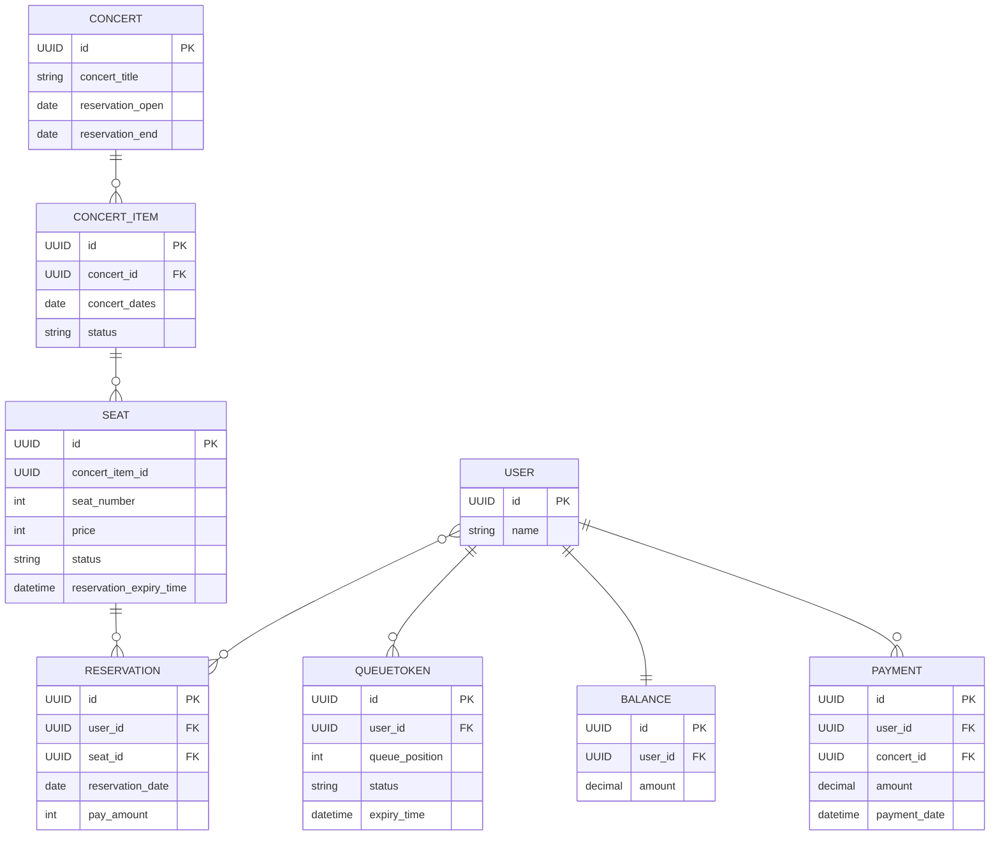

# hanghae_week3

**예매하기 FLOW CHART**

```mermaid
flowchart TD
    A["토큰 발급 API"] -- UUID 및 대기열 정보 포함 --> B["토큰 발급 완료"]
    B --> C["대기열 정보 확인"]
    C --> D["예매창 입장 가능 여부 확인"]
    D -- NO --> E["대기열 유지"]
    D -- YES --> F["예약 가능 날짜 / 좌석 조회"]
    F --> G["좌석 예약 요청"]
    G --> H["좌석 선점 유무 확인"]
    H -- YES --> I["좌석 재선택"]
    H -- NO --> J["결제"]
    J --> K["좌석 임시 배정 만료 여부"]
    K -- NO --> L["좌석 예약 실패"]
    K -- YES --> M["좌석 예약 성공"]

    style E color:#FFFFFF, fill:#AA00FF, stroke:#AA00FF
    style I color:#FFFFFF, stroke:#2962FF, fill:#2962FF
    style L fill:#00C853,stroke:#00C853,color:#FFFFFF
```

```mermaid
sequenceDiagram
    autonumber
    actor 사용자 as 사용자
    participant API
    participant 대기열

    사용자 ->> API: 대기열 입장 API 요청
    API ->> 대기열: 대기열 입장 요청
    대기열 ->> 대기열: 대기열 토큰 조회
    alt 기존 토큰 존재
        대기열 -->> API: 기존 토큰 반환
    else 기존 토큰 없음
        대기열 ->> 대기열: 새 토큰 생성
        대기열 -->> API: 새 토큰 반환
    end
    API -->> 사용자: 토큰 반환

    loop 대기열 순번 확인 API (N초마다 요청)
        사용자 ->> API: 대기번호 확인 API 요청
        API ->> 대기열: 대기번호 확인 요청
        대기열 ->> 대기열: 대기열 토큰 확인
        alt 토큰 만료
            대기열 ->> 대기열: 토큰 삭제
            대기열 ->> 사용자: 대기 취소
        end
        alt 대기열 통과
            대기열 ->> 대기열: 토큰 상태 업데이트
            대기열 -->> 사용자: 대기열 통과
        else 대기열 대기
            대기열 ->> 대기열: 순번 = 대기열 상태값이 WAITING 앞에 있는 토큰 수 + 1
            대기열 -->> API: 몇번째 대기 순번인지 반환
            API -->> 사용자: 몇번째 대기 순번인지 반환
        end
    end
```

```mermaid
sequenceDiagram
    autonumber
    Actor User as 사용자
    participant API
    participant ReservationAPI as 예매

    User ->> API: 날짜 요청 API
    API ->> ReservationAPI: 날짜 요청
    ReservationAPI -->> API: 예매 가능 날짜 반환
    API -->> User: 예매 가능 날짜 반환

    User ->> API: 좌석 요청 API
    API ->> ReservationAPI: 좌석 요청
    ReservationAPI -->> API: 예매 가능 좌석 반환
    API -->> User: 예매 가능 날짜 반환

    User -> API: 좌석 예매 요청 API
    API ->> ReservationAPI: 좌석 예매 요청
    ReservationAPI ->> ReservationAPI: 좌석 상태 조회

    alt 좌석이 선점 중이 아닐 때
        ReservationAPI ->> ReservationAPI: 좌석 상태를 선점으로 업데이트
        ReservationAPI -->> User: 결제 진행
    else 좌석이 선점 중일 때
        ReservationAPI -->> User: 예매 실패 반환
    end
```

```mermaid
sequenceDiagram
    autonumber
    Actor User as 사용자
    participant API
    participant 결제

    User ->> API: 충전 API 요청
    API ->> 결제: 충전 요청
    결제 ->> 결제: 잔액 확인 / 충전
    결제 -->> API: 충전 완료 반환
    API -->> User: 충전 완료 반환

    User ->> API: 결제 API 요청
    API ->> 결제: 결제 요청
    결제 ->> 결제: 잔액 검증

    alt 잔액이 충분할 때
        결제 ->> 결제: 결제
        결제 -->> API: 결제내역 반환
        API -->> User: 결제내역 반환
    else 잔액이 부족할 때
        결제 -->> API: 결제 실패 반환
        API -->> User: 결제 실패 반환
    end
```

테이블 ERD

```mermaid
erDiagram
    USER {
        UUID id PK
        string name
    }

    QUEUETOKEN {
        UUID id PK
        UUID user_id FK
        int queue_position
        string status
        datetime expiry_time
    }

    CONCERT_ITEM {
        UUID id PK
        UUID concert_id FK
        date concert_dates
        string status
    }

    SEAT {
        UUID id PK
        UUID concert_item_id
        int seat_number
        int price
        string status
        datetime reservation_expiry_time
    }

    PAYMENT {
        UUID id PK
        UUID user_id FK
        UUID concert_id FK
        decimal amount
        datetime payment_date
    }

    BALANCE {
        UUID id PK
        UUID user_id FK
        decimal amount
    }

    CONCERT {
        UUID id PK
        string concert_title
        date reservation_open
        date reservation_end
    }

    RESERVATION {
        UUID id PK
        UUID user_id FK
        UUID seat_id FK
        date reservation_date
        int pay_amount
    }

    %% Relationships
    USER ||--o{ QUEUETOKEN : ""
    USER ||--|| BALANCE : ""
    CONCERT_ITEM ||--o{ SEAT : ""
    SEAT ||--o{ RESERVATION : ""
    CONCERT ||--o{ CONCERT_ITEM : ""
    USER ||--o{ PAYMENT : ""
    USER }o--o{ RESERVATION : ""
```
